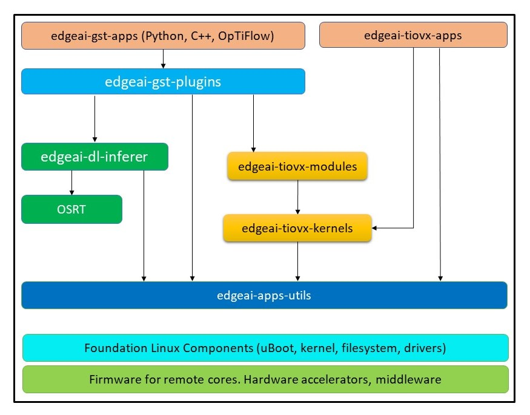

    <picture>
        <source media="(prefers-color-scheme: dark)" srcset=".meta/logo-dark.png" width="40%" />
        <source media="(prefers-color-scheme: light)" srcset=".meta/logo-light.png" width="40%" />
        
    </picture>

# EdgeAI App Stack

   

## What is it?

This repository contains the application stack for running AI inference workloads on the TI AM67A SoC, targeting T3 Gemstone boards. It includes demo applications, a model zoo, test data, and environment setup scripts.

For pre-built binaries and full documentation, visit [https://docs.t3gemstone.org/en/boards/o1/ai/introduction](https://docs.t3gemstone.org/en/boards/o1/ai/introduction).

> ⚠️ Note  
> This repository is designed to be built as part of the main **[ti-am67a-edgeai](https://github.com/t3gemstone/ti-am67-edgeai)** project.  
>  
> It relies on additional dependencies and components provided in the main repository.  
> Therefore, it is not intended to be built or used as a standalone project.

### Repository Table

| Repository | Description |
| - | - |
| **edgeai-apps-utils** | A collection of common utility functions and shared libraries for Edge AI applications.                         |
| **edgeai-dl-inferer** | Provides deep learning libraries for running AI models. |
| **edgeai-gst-apps** | This sample application allows developers to quickly understand and customize how to configure AI pipelines with model changes, camera sources, or output methods. |
| **edgeai-gst-plugins** | Contains GStreamer plugins optimized for TI platforms. Enables building pipelines for video processing and AI tasks. |
| **edgeai-test-data** | Contains test datasets, sample inputs, and reference data used for validating and benchmarking edge AI pipelines and applications. |
| **edgeai-tiovx-apps** | Contains TI OpenVX (TIOVX) based computer vision applications and examples. Essential for performance optimization. |
| **edgeai-tiovx-kernels** | Contains custom-developed, deep learning-based kernel functions for the TI OpenVX (TIOVX) framework. |
| **edgeai-tiovx-modules** | Contains custom-developed, modular components and higher-level building blocks built on top of the TI OpenVX (TIOVX) framework, enabling flexible integration and reuse of vision and deep learning pipelines. |
| **imaging** | Contains imaging-related components, including image processing utilities, pipelines, and supporting modules built on top of the TI OpenVX (TIOVX) framework. |
| **oob-demo-assets** | Contains out-of-box demo assets such as sample data, models, and configuration files used for demonstrating edge AI capabilities. |
| **ti-gpio-cpp** | Provides C++ based utilities and interfaces for interacting with GPIO on TI platforms. |
| **ti-gpio-py** | Provides Python-based utilities and bindings for controlling and interacting with GPIO on TI platforms.|
| **tidl_test** | Contains test applications and validation tools for TI Deep Learning (TIDL) components and workflows. |
| **vision_apps** | Contains ready-to-use vision applications, reference pipelines, and demos leveraging TI OpenVX and edge AI capabilities. |

## Dependencies Overview

The following diagram illustrates the dependency relationships between the core repositories and components within the Edge AI software stack. It provides a high-level view of how modules such as TIOVX kernels, modules, vision applications, and supporting libraries interact with each other.

> **Note:** This diagram is intended to help developers understand the architectural structure, integration points, and data flow across different layers of the system.